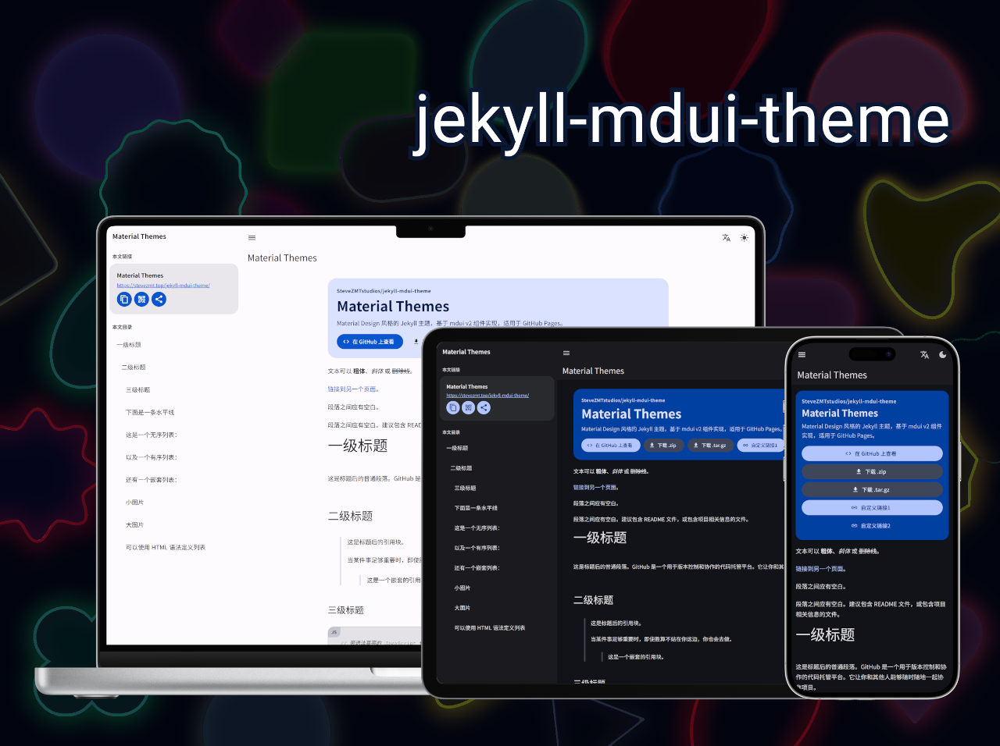

# Jekyll mdui Theme

[](https://github.com/SteveZMTstudios/jekyll-mdui-theme/actions/workflows/pages/pages-build-deployment)
[](https://github.com/SteveZMTstudios/jekyll-mdui-theme/releases)
[](/LICENSE)

[简体中文](README.md) | English (US)

A Jekyll theme for GitHub Pages built with mdui v2 components, supporting one-step integration via `remote_theme`.

*mdui is a modern Material Design component library. This theme is built on mdui v2 Web Components. You can [preview it here](https://stevezmt.top/jekyll-mdui-theme/), or [get started now](#quick-start-github-pages).* 



## Quick Start (GitHub Pages)

Add the following to your site repository `_config.yml`:

```yml
remote_theme: SteveZMTstudios/jekyll-mdui-theme
plugins:
  - jekyll-remote-theme

title: Your Site Title
description: Your site description

show_downloads: true
theme_color: "#0b57d0"
url: "https://<username>.github.io"
baseurl: "" # Leave empty for user/org pages; use "/<repo>" for project sites
```

If you want to pin a release version, use:

```yml
remote_theme: SteveZMTstudios/jekyll-mdui-theme@v1.0.0
```

### About assets (avoid 404 errors)

This theme's CSS/JS files are located in the theme repository's `assets/` directory.

When using `remote_theme` with `jekyll-remote-theme`, Jekyll will include and output those assets during build time, so your site repository does not need to copy `assets` locally.

If you see 404 errors, first check:

1. Whether `_config.yml` has enabled:
  - `remote_theme: SteveZMTstudios/jekyll-mdui-theme`
  - `plugins: [jekyll-remote-theme]`
2. Whether `baseurl` matches your deployment path (project sites usually use `/<repo>`).
3. Whether a local file with the same path is overriding it (for example, your own `assets/css/style.css`).

Or, use this repository as a starting template:

<a href="https://github.com/new?template_name=jekyll-mdui-theme&template_owner=SteveZMTstudios">
  
</a>

> [!WARNING]
> If you create a repository directly from this template, remove example content as needed (such as `test.md` and `THEME_SYNTAX.md`).

## Local Preview (Sites using remote_theme)

In your site repository `Gemfile`, make sure you have:

```ruby
source "https://rubygems.org"

gem "github-pages", group: :jekyll_plugins
gem "jekyll-remote-theme", group: :jekyll_plugins
gem "webrick", "~> 1.8"
```

Then run:

```bash
bundle install
bundle exec jekyll serve
```

Visit: <http://127.0.0.1:4000>

## Theme Features

- Native mdui v2 component layout (Top App Bar, Navigation Drawer, List, Button, Fab)
- Material Design 3 style
- Automatic article table of contents generation (H1/H2/H3)
- Code block copy button
- Print-optimized styles
- Dynamic color theming (generates Material palette from `theme_color`)
- Built-in translation script (write in one language, global users see translation automatically)
- Light / dark / auto theme switching
- Responsive design (mobile, tablet, desktop)
- Sidebar article card (title + URL copy, Web Share, QR code)
- GitHub Pages style buttons (View on GitHub / Download .zip / Download .tar.gz)

## Encrypted Pages (Optional)

The theme includes built-in client-side decryption. Use the scripts below to encrypt or decrypt Markdown before build.

### 1) Mark a Markdown page for encryption

Add `encrypt` in the Front Matter:

```yml
---
title: Encrypted Page
encrypt: "your-password"
password_prompt: "Enter password to decrypt" # Optional: custom dialog text
---
```

### 2) Run the encryption script

Node.js version:

```bash
node script/encrypt.js path/to/file.md
node script/encrypt.js path/to/folder
```

Python version (install dependency first):

```bash
pip install cryptography
python script/encrypt.py path/to/file.md
python script/encrypt.py path/to/folder
```

> The script reads the `encrypt` field as the password, writes `encrypted: true`, `crypto_*`, and `ciphertext`, and removes the plaintext body.

### 3) Restore plaintext

Use the decrypt script to restore the original Markdown content:

```bash
python script/decrypt.py path/to/file.md your-password
python script/decrypt.py path/to/folder your-password
```

### 4) Runtime behavior

- The password field uses form validation and helper text; invalid passwords shake and clear the input.
- “Remember password” stores the password in local storage.
- If the stored credential no longer matches, a warning will appear: “Credentials have changed since your last visit.”

## Configuration

The mdui theme follows these variables in `_config.yml`:

```yml
title: [Your site title]
description: [Your site description]
```

In addition, you may optionally set:

```yml
repository: [GitHub repository path, e.g. octocat/hello-world]
show_downloads: true  # Whether to show download buttons, true or false (no quotes)
theme_color: "#0b57d0"  # Theme color seed (Material color source)
google_analytics: [your Google Analytics tracking ID]  # Optional

# Optional: append custom buttons under hero-actions
links:
  - name: "Docs"
    url: "https://example.com/docs"
    icon: "description"   # Optional, Material Icons name
    variant: "tonal"      # Optional: elevated/filled/tonal/outlined/text (flat will be converted to text automatically)
    _target: "_blank"     # Optional, default is _self
    rel: "noopener noreferrer" # Optional, automatically added when _blank is used without setting rel
```

For the full configuration reference, see [THEME_SYNTAX.md](THEME_SYNTAX.md) and [_config.yml](_config.yml).

### Override GitHub-generated URLs

The template usually relies on GitHub-provided URLs (for links to your repository or downloads). If you want to override one or more URLs:

1. Check the [layout source](https://github.com/SteveZMTstudios/jekyll-mdui-theme/blob/main/_layouts/default.html) to find the variable names. They usually appear as `{{ site.github.zip_url }}`.
2. In your site's `_config.yml`, specify the URL(s) you want to use. For example, if the variable is `site.github.zip_url`, add:
    ```yml
    github:
    zip_url: https://example.com/download.zip
    repository_url: https://example.com/your-repo
    tar_url: https://example.com/download.tar.gz
    ```
3. When your site builds, Jekyll will use the URLs you specify instead of GitHub's defaults.

*Note: remove the `site.` prefix; each variable name under `github:` should be indented with two spaces.*

### Custom CSS styling

If you want to add your own custom styles:

1. Create a file in your site: `/assets/css/style.scss`
2. At the top of that file, add the following exactly as shown:
    ```scss
    ---
    ---

    @import "{{ site.theme }}";
    ```
3. Add any custom CSS (or Sass, including imports) immediately after the `@import` line.

*Note: if you want to change theme Sass variables, you must set new values before the `@import` line in your stylesheet.*

### Override layouts

If you want to modify the theme's HTML layout:

#### Small changes

1. Add custom files in your local `_includes` folder.
2. The theme's default includes are a good starting point and are included by the [original layout template](https://github.com/SteveZMTstudios/jekyll-mdui-theme/blob/main/_layouts/default.html).

For example, to add custom Google Analytics:

1. Paste the latest Analytics snippet from Google into `_includes/head-custom-google-analytics.html`.
2. The theme will automatically include that file.

#### Major changes

1. [Copy the original template](https://github.com/SteveZMTstudios/jekyll-mdui-theme/blob/main/_layouts/default.html)
   (*Protip: click “raw” to make copying easier*)
2. Create a file in your site: `/_layouts/default.html`
3. Paste the copied layout content into it
4. Customize the layout to meet your needs

## Theme structure and compatibility

This repository follows the common GitHub Pages theme structure. It can be used both as a `remote_theme` remote theme and as a standard Jekyll theme gem:

- `_layouts/default.html` - main layout template
- `_includes/head-custom.html` - custom head entry point that can be overridden in your site
- `assets/css/*` and `assets/js/*` - style and script files
- `lib/jekyll-mdui-theme.rb` - theme Ruby entry point
- `lib/jekyll-mdui-theme/version.rb` - version definition
- `jekyll-mdui-theme.gemspec` - gem specification file

### Browser compatibility strategy

- **Modern browsers**: full mdui Web Components experience
- **IE11 and similar legacy browsers**: automatically enable compatibility reading mode to ensure basic layout, links, image rendering, theme switching, and code copy remain available
- **IE6/older browsers and JavaScript-disabled scenarios**: the page remains readable, images render, and links remain accessible, but the full reading experience is not guaranteed.

## Local development

If you want to preview the theme locally (for example, when making changes):

1. Clone this theme repository: `git clone https://github.com/SteveZMTstudios/jekyll-mdui-theme`
2. Enter the repository directory: `cd jekyll-mdui-theme`
3. Run `bundle install` to install dependencies
4. Run `bundle exec jekyll serve` to start the preview server
5. Visit [`localhost:4000`](http://localhost:4000) in your browser to preview the theme

### Run tests

This theme includes a minimal test suite to ensure a site using the theme can build successfully:

```bash
bundle exec jekyll build
```

## Contributing

Interested in improving the mdui theme? Contributions are welcome. The mdui theme is an open source project built one feature at a time by users like you.

If you find a bug or have a feature idea:

- Open an issue at [GitHub Issues](https://github.com/SteveZMTstudios/jekyll-mdui-theme/issues)
- Submit a pull request

## License

[MIT License](LICENSE)
